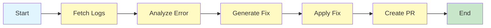

# 🔧 DevOps Pipeline Healer Agent

<div align="center">


**An intelligent AI-powered agent that automatically detects, analyzes, and fixes failed GitHub Actions pipelines**

[Getting Started](#-getting-started) • [How It Works](#-how-it-works) • [Architecture](#-architecture) • [Examples](#-sample-flows)

</div>

---

## 🎯 Overview

Pipeline Healer Agent is a sophisticated DevOps automation tool that leverages **LangGraph** and **Groq LLM** to autonomously heal broken CI/CD pipelines. When your GitHub Actions workflow fails, this agent:

1. **Fetches** the error logs from the failed workflow run
2. **Analyzes** the root cause using AI (identifies error type, affected files, and issue details)
3. **Generates** an intelligent fix for the problematic code
4. **Applies** the fix to a new branch
5. **Creates** a pull request for human review

This enables rapid self-healing pipelines while maintaining human oversight through the PR review process.

---

## ✨ Key Features

| Feature                           | Description                                                                                         |
| --------------------------------- | --------------------------------------------------------------------------------------------------- |
| 🔍 **Intelligent Error Analysis** | Uses Groq's Llama 3.3 70B model to understand error types (syntax, dependency, configuration, etc.) |
| 🔄 **Automated Fix Generation**   | Generates complete code fixes based on error analysis and file context                              |
| 🌿 **Branch Management**          | Automatically creates timestamped branches (`auto-fix-{timestamp}`) for fixes                       |
| 📝 **Pull Request Creation**      | Creates detailed PRs with error analysis, fix explanation, and affected files                       |
| 🛡️ **Safe Automation**            | All changes require human review before merging to main                                             |
| 📊 **State-Based Workflow**       | Uses LangGraph for reliable, trackable workflow execution                                           |

---

## 🏗️ Architecture

The agent follows a state-based workflow using **LangGraph's StateGraph**:



### Workflow Nodes

| Node            | Description                                                  |
| --------------- | ------------------------------------------------------------ |
| `fetch_logs`    | Retrieves error logs from the failed GitHub Actions run      |
| `analyze_error` | Uses LLM to identify error type, failed file, and root cause |
| `generate_fix`  | Generates corrected code based on error analysis             |
| `apply_fix`     | Creates a new branch and commits the fix                     |
| `create_pr`     | Opens a pull request with detailed fix documentation         |

---

## 📂 Project Structure

```
pipeline-healer/
├── .env                      # Environment variables (API keys)
├── main.py                   # Entry point - CLI interface
├── agent/
│   ├── __init__.py
│   ├── graph.py              # LangGraph workflow definition
│   └── state.py              # State schema (PipelineHealingState)
├── tools/
│   ├── __init__.py
│   ├── github_tools.py       # GitHub API integration tools
│   └── code_fixer.py         # Code fix generation utilities
├── sample_flows/             # Learning examples
│   ├── simple_agent.py       # Basic LLM agent example
│   ├── agent_with_memory.py  # Agent with conversation memory
│   ├── agent_with_tool.py    # Agent with file management tools
│   └── simple_graph.py       # Basic LangGraph workflow example
├── examples/                 # Example failing code for testing
├── requirements.txt          # Python dependencies
└── README.md
```

---

## 🚀 Getting Started

### Prerequisites

- **Python 3.10+**
- **GitHub Account** with a Personal Access Token
- **Groq API Key** (free tier available at [console.groq.com](https://console.groq.com))

### Installation

1. **Clone the repository**

   ```bash
   git clone https://github.com/yourusername/Pipeline-Healer-agent.git
   cd Pipeline-Healer-agent
   ```

2. **Create and activate a virtual environment**

   ```bash
   python -m venv venv
   source venv/bin/activate  # On Windows: venv\Scripts\activate
   ```

3. **Install dependencies**

   ```bash
   pip install -r requirements.txt
   ```

4. **Configure environment variables**

   Create a `.env` file in the project root:

   ```env
   GROQ_API_KEY=your_groq_api_key_here
   GITHUB_TOKEN=your_github_personal_access_token_here
   ```

   > ⚠️ **Important**: Your GitHub token needs `repo` scope permissions for full repository access (reading files, creating branches, and opening PRs).

### Usage

Run the healer agent:

```bash
python main.py
```

You'll be prompted to enter:

1. **Repository name** in format `username/repo-name`
2. **Workflow run ID** (found in the GitHub Actions URL)

**Example:**

```
🚀 Pipeline Healer Agent Starting...
============================================================
Enter your repository (format: username/repo-name):
> myusername/my-failing-project

Enter the failed workflow run ID:
(You can find this in the GitHub Actions URL)
> 12345678901

Repository: myusername/my-failing-project
Run ID: 12345678901
============================================================
📥 Fetching logs from GitHub...
🔍 Analyzing error...
🔧 Generating fix...
✍️ Applying fix to new branch...
📝 Creating pull request...

============================================================
✅ HEALING COMPLETE!
============================================================
Pull Request: https://github.com/myusername/my-failing-project/pull/42
Branch: auto-fix-1706799315
```

### Finding the Workflow Run ID

1. Go to your repository on GitHub
2. Click on the **Actions** tab
3. Click on the failed workflow run
4. Copy the run ID from the URL: `https://github.com/user/repo/actions/runs/[RUN_ID]`

---

## 🔧 GitHub Tools

The agent provides several pre-built tools for GitHub interaction:

| Tool                            | Description                                                                    |
| ------------------------------- | ------------------------------------------------------------------------------ |
| `get_workflow_run_logs`         | Fetches logs from a specific workflow run, filtering for failed jobs and steps |
| `get_file_content`              | Retrieves file content from any branch in the repository                       |
| `create_branch_and_update_file` | Creates a new branch from default and commits a file update                    |
| `create_pull_request`           | Opens a PR with customizable title, body, and branch targets                   |
| `list_recent_workflow_runs`     | Lists recent workflow runs with their status and conclusions                   |

---

## 📚 Sample Flows

The `sample_flows/` directory contains educational examples to help you understand the underlying concepts:

### 1. Simple Agent (`simple_agent.py`)

Basic example of using Groq LLM to analyze error logs.

```bash
python sample_flows/simple_agent.py
```

### 2. Agent with Memory (`agent_with_memory.py`)

Demonstrates conversation memory for multi-turn interactions.

```bash
python sample_flows/agent_with_memory.py
```

### 3. Agent with Tools (`agent_with_tool.py`)

Shows how to create agents with custom file management tools.

```bash
python sample_flows/agent_with_tool.py
```

### 4. Simple Graph (`simple_graph.py`)

Illustrates basic LangGraph workflow concepts with a two-step error analysis pipeline.

```bash
python sample_flows/simple_graph.py
```

---

## 🔌 API Reference

### PipelineHealingState

The state object that flows through the healing workflow:

```python
class PipelineHealingState(TypedDict):
    # Input
    repo_name: str          # e.g., "username/pipeline-test"
    run_id: str             # Workflow run ID

    # Processing
    error_logs: str         # Raw error logs from GitHub
    failed_file: str        # Which file caused the error
    error_analysis: str     # AI's understanding of the error

    # Fix generation
    proposed_fix: str       # The corrected code
    fix_explanation: str    # Why this fix should work

    # Execution
    branch_name: str        # Branch created with fix
    pr_url: Optional[str]   # Pull request URL

    # Status tracking
    current_step: str       # Current step in workflow
    success: bool           # Did we successfully fix it?
```

### heal_pipeline Function

```python
def heal_pipeline(repo_name: str, run_id: str) -> dict:
    """
    Main function to heal a failed pipeline.

    Args:
        repo_name: GitHub repo in format 'owner/repo'
        run_id: The workflow run ID that failed

    Returns:
        Final state dict with PR URL, branch name, and fix details
    """
```

---

## 🛠️ Tech Stack

| Technology                                                      | Purpose                                    |
| --------------------------------------------------------------- | ------------------------------------------ |
| **[LangGraph](https://github.com/langchain-ai/langgraph)**      | State graph orchestration for AI workflows |
| **[LangChain](https://langchain.com)**                          | LLM integration and prompt management      |
| **[Groq](https://groq.com)**                                    | Ultra-fast LLM inference (Llama 3.3 70B)   |
| **[PyGithub](https://pygithub.readthedocs.io)**                 | GitHub API integration                     |
| **[python-dotenv](https://github.com/theskumar/python-dotenv)** | Environment variable management            |

---

## 🤝 Contributing

Contributions are welcome! Here's how you can help:

1. **Fork** the repository
2. **Create** a feature branch (`git checkout -b feature/amazing-feature`)
3. **Commit** your changes (`git commit -m 'Add amazing feature'`)
4. **Push** to the branch (`git push origin feature/amazing-feature`)
5. **Open** a Pull Request

### Ideas for Contributions

- [ ] Add support for more CI/CD platforms (GitLab CI, Jenkins, CircleCI)
- [ ] Implement retry logic with exponential backoff
- [ ] Add Slack/Discord notifications for healing events
- [ ] Create a web dashboard for monitoring healed pipelines
- [ ] Support for multi-file fixes
- [ ] Add test coverage for the healing workflow

---

## ⚠️ Limitations

- Currently supports GitHub Actions only
- Single-file fixes only (multi-file support planned)
- Requires public repository or PAT with appropriate scopes
- LLM-generated fixes should always be reviewed before merging

---

## 📄 License

This project is licensed under the MIT License - see the [LICENSE](LICENSE) file for details.

---

## 🙏 Acknowledgments

- [LangChain](https://langchain.com) for the amazing AI framework
- [Groq](https://groq.com) for lightning-fast inference
- The open-source community for continuous inspiration

---

<div align="center">

**Made with ❤️ for DevOps Engineers everywhere**

_Star ⭐ this repo if you found it helpful!_

</div>
