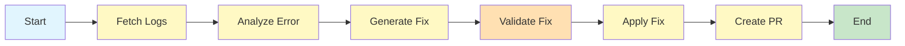

# 🔧 DevOps Pipeline Healer Agent

<div align="center">


**An AI-powered agent that automatically detects, analyzes, and fixes failed GitHub Actions pipelines**

[Use as GitHub Action](#-use-as-a-github-action) • [Run Locally](#-run-locally-cli) • [API Server](#-api-server) • [Architecture](#-architecture) • [Contributing](#-contributing)

</div>

---

## 🎯 What Does It Do?

When your GitHub Actions workflow fails, Pipeline Healer **automatically**:

1. 📥 **Fetches** error logs from the failed run
2. 🔍 **Analyzes** the root cause using AI (syntax error? missing dependency? bad config?)
3. 🔧 **Generates** an intelligent code fix
4. 🌿 **Creates** a new branch with the fix
5. 📝 **Opens** a pull request for your review

You review the PR, merge if it looks good. **That's it — self-healing pipelines.**

---

## 🚀 Use as a GitHub Action

The **easiest way** to use Pipeline Healer — add one workflow file and your repo heals itself.

### Quick Setup (3 Steps)

**Step 1:** Get a free Groq API key at [console.groq.com](https://console.groq.com)

**Step 2:** Add it as a repo secret:

> **Repo → Settings → Secrets and variables → Actions → New repository secret**
> Name: `GROQ_API_KEY` | Value: your key

**Step 3:** Create `.github/workflows/auto-heal.yml` in your repo:

```yaml
name: 🔧 Auto-Heal Pipeline

on:
  workflow_run:
    workflows: ["*"] # Watches all your workflows
    types: [completed]

jobs:
  heal:
    if: ${{ github.event.workflow_run.conclusion == 'failure' }}
    runs-on: ubuntu-latest
    permissions:
      contents: write
      pull-requests: write

    steps:
      - name: 🔧 Run Pipeline Healer
        id: healer
        uses: JAI0705/DevOps_Pipeline_healer_agent@v1
        with:
          groq-api-key: ${{ secrets.GROQ_API_KEY }}
          github-token: ${{ secrets.GITHUB_TOKEN }}

      - name: 📋 Summary
        if: steps.healer.outputs.success == 'true'
        run: |
          echo "## ✅ Pipeline Auto-Healed!" >> $GITHUB_STEP_SUMMARY
          echo "**PR:** ${{ steps.healer.outputs.pr-url }}" >> $GITHUB_STEP_SUMMARY
          echo "**Analysis:** ${{ steps.healer.outputs.error-analysis }}" >> $GITHUB_STEP_SUMMARY
```

Push this file. **Done!** Every future pipeline failure triggers the healer automatically.

### Action Inputs

| Input          | Required | Default                   | Description                            |
| -------------- | -------- | ------------------------- | -------------------------------------- |
| `groq-api-key` | ✅       |                           | Your Groq API key                      |
| `github-token` | ✅       | `${{ github.token }}`     | GitHub token (auto-provided by GitHub) |
| `run-id`       | ❌       | Auto-detected from event  | Specific workflow run ID to heal       |
| `repo`         | ❌       | Auto-detected from event  | Repository in `owner/repo` format      |
| `llm-model`    | ❌       | `llama-3.3-70b-versatile` | Groq LLM model to use                  |

### Action Outputs

| Output           | Description                                |
| ---------------- | ------------------------------------------ |
| `pr-url`         | URL of the created pull request            |
| `branch-name`    | Name of the fix branch                     |
| `error-analysis` | AI analysis of what caused the failure     |
| `success`        | Whether healing succeeded (`true`/`false`) |

---

## 💻 Run Locally (CLI)

For manual use or development:

### Prerequisites

- **Python 3.10+**
- **Groq API Key** — free at [console.groq.com](https://console.groq.com)
- **GitHub Token** — with `repo` scope ([generate here](https://github.com/settings/tokens))

### Installation

```bash
git clone https://github.com/JAI0705/DevOps_Pipeline_healer_agent.git
cd DevOps_Pipeline_healer_agent

python -m venv venv
source venv/bin/activate  # Windows: venv\Scripts\activate

pip install -r requirements.txt
```

### Configure

```bash
cp .env.example .env
# Edit .env with your actual API keys
```

### Run

```bash
python main.py
```

```
🚀 Pipeline Healer Agent Starting...
============================================================
Enter your repository (format: username/repo-name):
> myusername/my-project

Enter the failed workflow run ID:
> 12345678901

============================================================
📥 Fetching logs from GitHub...
🔍 Analyzing error...
🔧 Generating fix...
✍️ Applying fix to new branch...
📝 Creating pull request...

============================================================
✅ HEALING COMPLETE!
============================================================
Pull Request: https://github.com/myusername/my-project/pull/42
Branch: auto-fix-1706799315
```

> 💡 **Finding the Run ID:** Go to your repo → Actions tab → click the failed run → copy the ID from the URL: `github.com/user/repo/actions/runs/[THIS_NUMBER]`

---

## 🌐 API Server

Run Pipeline Healer as a REST API for programmatic access and webhook-based automation.

### Start the Server

```bash
pip install fastapi uvicorn
uvicorn api.server:app --host 0.0.0.0 --port 8000 --reload
```

### Endpoints

| Method | Endpoint           | Description                                  |
| ------ | ------------------ | -------------------------------------------- |
| POST   | `/heal`            | Trigger a healing job (runs in background)   |
| GET    | `/status/{job_id}` | Check the status of a healing job            |
| GET    | `/health`          | Health check                                 |
| GET    | `/history`         | View recent healing jobs                     |
| POST   | `/webhook/github`  | Receive GitHub webhook events (auto-trigger) |
| GET    | `/docs`            | Interactive Swagger UI documentation         |

### Example: Trigger Healing via API

```bash
curl -X POST http://localhost:8000/heal \
  -H "Content-Type: application/json" \
  -d '{"repo_name": "myusername/my-project", "run_id": "12345678901"}'
```

Response:

```json
{
  "job_id": "a1b2c3d4",
  "status": "queued",
  "message": "Healing job queued for myusername/my-project"
}
```

```bash
# Check status
curl http://localhost:8000/status/a1b2c3d4
```

### GitHub Webhooks (Auto-Trigger)

Set up a webhook so the API server **auto-heals** any failed workflow:

1. Go to your repo → **Settings → Webhooks → Add webhook**
2. **Payload URL:** `https://your-server/webhook/github`
3. **Content type:** `application/json`
4. **Secret:** set `GITHUB_WEBHOOK_SECRET` in your `.env`
5. **Events:** select **Workflow runs**

---

## 🐳 Docker

### Quick Start

```bash
docker compose up --build
```

The API server runs at `http://localhost:8000`.

### Build Manually

```bash
docker build -t pipeline-healer .
docker run -p 8000:8000 --env-file .env pipeline-healer
```

---

## 🏗️ Architecture

The agent follows a state-based workflow using **LangGraph's StateGraph**:


```mermaid
graph LR
    A[Start] --> B[Fetch Logs]
    B --> C[Analyze Error]
    C --> D[Generate Fix]
    D --> E[Validate Fix]
    E --> F[Apply Fix]
    F --> G[Create PR]
    G --> H[End]

    style A fill:#e1f5fe
    style H fill:#c8e6c9
    style B fill:#fff9c4
    style C fill:#fff9c4
    style D fill:#fff9c4
    style E fill:#ffe0b2
    style F fill:#fff9c4
    style G fill:#fff9c4
```

### How Each Step Works

| Node            | What It Does                                                         |
| --------------- | -------------------------------------------------------------------- |
| `fetch_logs`    | Calls GitHub API to get error logs from the failed workflow run      |
| `analyze_error` | Sends logs to LLM → returns error type, failed file, root cause      |
| `generate_fix`  | Fetches the broken file, sends to LLM with context → gets fixed code |
| `validate_fix`  | Checks syntax (Python AST, YAML, JSON) and scores fix confidence     |
| `apply_fix`     | Creates a timestamped branch and commits the corrected file          |
| `create_pr`     | Opens a PR with error analysis, fix explanation, and affected files  |

### Production Features

- **Retry logic** — LLM and GitHub API calls use exponential backoff (tenacity)
- **Structured logging** — JSON logs with timestamps, step tracking, correlation IDs
- **Input validation** — Repo name format, run ID, env vars checked before workflow starts
- **Custom exceptions** — `HealingError`, `GitHubAPIError`, `LLMError`, `ValidationError`
- **Fix validation** — Syntax checking (Python/YAML/JSON) + confidence scoring before applying

---

## 📂 Project Structure

```
DevOps_Pipeline_healer_agent/
├── action.yml                    # GitHub Action definition
├── action_entrypoint.py          # GitHub Action entry point
├── Dockerfile                    # Production Docker image
├── Dockerfile.action             # GitHub Action Docker image
├── docker-compose.yml            # Local development with Docker
├── main.py                       # CLI entry point
├── pyproject.toml                # Project metadata & tool configs
├── requirements.txt              # Production dependencies
├── requirements-dev.txt          # Dev dependencies (pytest, ruff, etc.)
├── .env.example                  # Environment variable template
│
├── agent/                        # Core healing workflow
│   ├── graph.py                  # LangGraph 5-node pipeline
│   └── state.py                  # PipelineHealingState schema
│
├── tools/                        # LangChain tools
│   ├── github_tools.py           # GitHub API (logs, branches, PRs)
│   └── code_fixer.py             # Fix validation & confidence scoring
│
├── api/                          # REST API & webhooks
│   ├── server.py                 # FastAPI application
│   ├── webhooks.py               # GitHub webhook handler
│   └── models.py                 # Pydantic request/response models
│
├── config/
│   └── settings.py               # Centralized Pydantic settings
│
├── utils/                        # Shared utilities
│   ├── exceptions.py             # Custom exception hierarchy
│   ├── validators.py             # Input validation
│   └── logger.py                 # Structured logging
│
├── tests/                        # Test suite (38 tests)
│   ├── conftest.py               # Fixtures & auto-mocked env vars
│   ├── test_graph.py             # Workflow node tests
│   ├── test_github_tools.py      # GitHub tools tests
│   ├── test_validators.py        # Validation tests
│   └── mocks/                    # Mock GitHub API & LLM responses
│
├── examples/                     # Example files
│   ├── usage-workflow.yml        # Copy-paste GitHub Action workflow
│   ├── buggy_script.py           # Example buggy Python file
│   └── broken_workflow.yml       # Example broken CI workflow
│
├── sample_flows/                 # Educational examples
│   ├── simple_agent.py           # Basic LLM agent
│   ├── agent_with_memory.py      # Agent with conversation memory
│   ├── agent_with_tool.py        # Agent with custom tools
│   └── simple_graph.py           # Basic LangGraph workflow
│
└── .github/workflows/
    └── ci.yml                    # CI pipeline (lint + test + Docker)
```

---

## 🧪 Testing

```bash
# Install dev dependencies
pip install -r requirements-dev.txt

# Run all tests
python -m pytest tests/ -v

# Run with coverage
python -m pytest tests/ -v --cov=. --cov-report=term-missing

# Lint
ruff check .
```

**38 tests** covering:

- ✅ Input validation (repo names, run IDs, env vars)
- ✅ GitHub API tools (log fetching, file reading, PR creation, branch creation)
- ✅ Workflow nodes (each node tested independently with mocked LLM & GitHub API)
- ✅ Error handling (API failures, invalid LLM responses, missing data)

---

## ⚙️ Configuration

All settings can be configured via environment variables or `.env`:

```env
# Required
GROQ_API_KEY=your_groq_api_key
GITHUB_TOKEN=your_github_token

# Optional
LLM_MODEL=llama-3.3-70b-versatile
LLM_TEMPERATURE=0.0
MAX_RETRIES=3
LOG_LEVEL=INFO
LOG_JSON=false                    # Set to true for production JSON logs
DEFAULT_BASE_BRANCH=main
BRANCH_PREFIX=auto-fix
GITHUB_WEBHOOK_SECRET=your_secret # For webhook signature verification
```

---

## 🛠️ Tech Stack

| Technology                                                 | Purpose                                       |
| ---------------------------------------------------------- | --------------------------------------------- |
| **[LangGraph](https://github.com/langchain-ai/langgraph)** | State graph orchestration for the AI workflow |
| **[LangChain](https://langchain.com)**                     | LLM integration and tool framework            |
| **[Groq](https://groq.com)**                               | Ultra-fast LLM inference (Llama 3.3 70B)      |
| **[FastAPI](https://fastapi.tiangolo.com)**                | REST API server with auto-generated docs      |
| **[PyGithub](https://pygithub.readthedocs.io)**            | GitHub API integration                        |
| **[Pydantic](https://docs.pydantic.dev)**                  | Settings management & data validation         |
| **[Tenacity](https://tenacity.readthedocs.io)**            | Retry logic with exponential backoff          |
| **[Docker](https://docker.com)**                           | Containerization & deployment                 |

---

## 🤝 Contributing

Contributions are welcome! Here's how:

1. **Fork** the repository
2. **Create** a feature branch (`git checkout -b feature/amazing-feature`)
3. **Run tests** (`python -m pytest tests/ -v`)
4. **Commit** your changes (`git commit -m 'Add amazing feature'`)
5. **Push** to the branch (`git push origin feature/amazing-feature`)
6. **Open** a Pull Request

### Ideas for Contributions

- [ ] Add support for GitLab CI / Jenkins / CircleCI
- [ ] Multi-file fix support (batch fixes into single PR)
- [ ] Slack / Discord notifications for healing events
- [ ] Smart caching of similar error patterns
- [ ] Web dashboard for monitoring healed pipelines
- [ ] Fix pattern learning (remember what worked before)

---

## ⚠️ Limitations

- Currently supports **GitHub Actions only** (multi-platform planned)
- **Single-file fixes** only (multi-file support planned)
- Requires a **Groq API key** (free tier available)
- LLM-generated fixes should **always be reviewed** before merging
- The `GITHUB_TOKEN` provided by Actions has limited permissions — for private repos, use a PAT with `repo` scope

---

## 📄 License

This project is licensed under the MIT License — see the [LICENSE](LICENSE) file for details.

---

## 🙏 Acknowledgments

- [LangChain](https://langchain.com) & [LangGraph](https://github.com/langchain-ai/langgraph) for the AI workflow framework
- [Groq](https://groq.com) for lightning-fast LLM inference
- The open-source community for continuous inspiration

---

<div align="center">

**Made with ❤️ for DevOps Engineers everywhere**

_Star ⭐ this repo if you found it helpful!_

[Report Bug](https://github.com/JAI0705/DevOps_Pipeline_healer_agent/issues) · [Request Feature](https://github.com/JAI0705/DevOps_Pipeline_healer_agent/issues) · [Discussions](https://github.com/JAI0705/DevOps_Pipeline_healer_agent/discussions)

</div>
